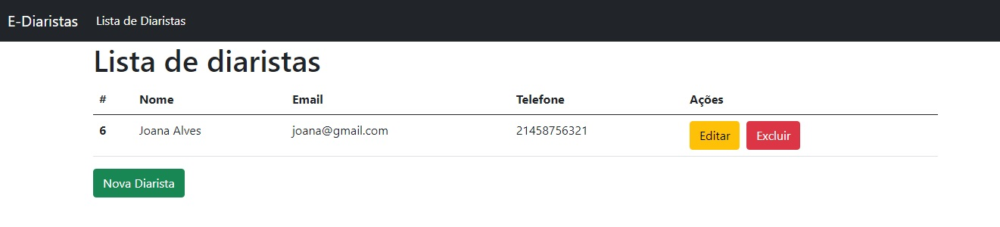
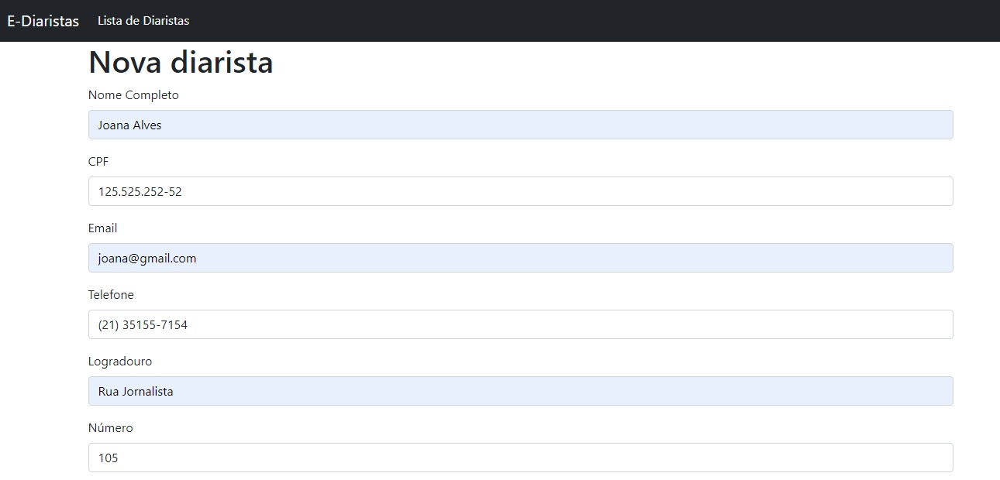

# Cadastro de Diáristas no banco de dados 

 Formulário de cadastro de diárista com Laravel PHP utilizando o metodo CRUD 
 para Criar, Ler, Editar e Excluir uma diárista no banco de dados... 

 
 

Lisar Diáristas

Formulário de Cadastro

